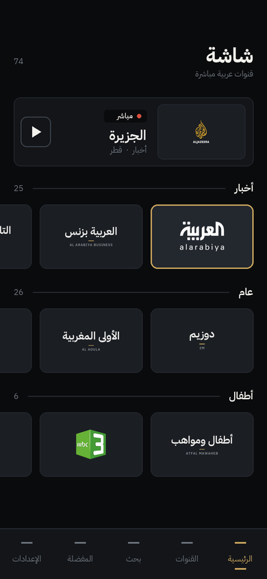
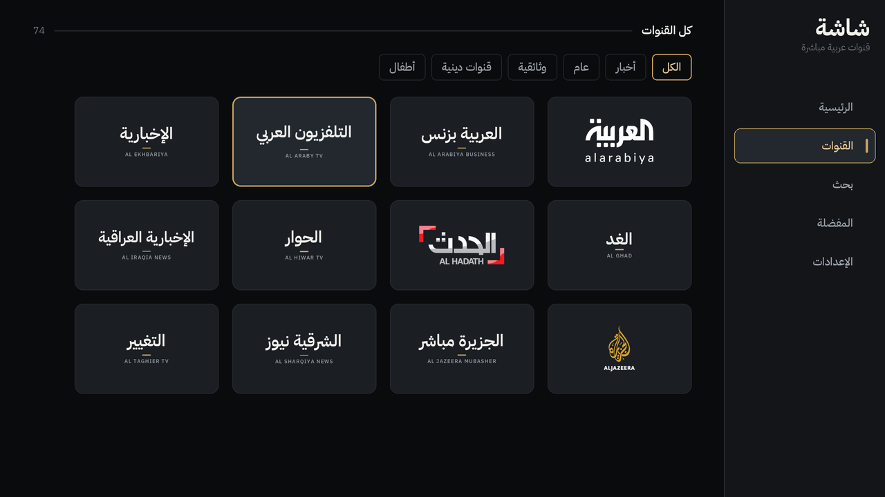

# شاشة · Shasha

An Android app for watching free-to-air **Arabic** television. One APK installs
on a phone and on a TV. It is not published on Google Play — you download the
APK and sideload it.

- **74 Arabic channels** across news, general, documentary, religious and kids
- **Free-to-air only.** Every stream is one the broadcaster publishes itself for
  public live viewing. Nothing here is encrypted, subscription-gated, or scraped
  from a paid service, and the app does not circumvent anything.
- **Works offline on first launch.** The channel list and all 74 artwork tiles
  are bundled in the APK, so the grid is populated before any network request.
- **Arabic-first.** Right-to-left throughout, Arabic names lead, with English
  available from Settings.

<table>
<tr>
<td width="34%"></td>
<td></td>
</tr>
</table>

> These two images are **layout mockups**, not screenshots. They are drawn by
> `tools/gen_preview.py` from the same inputs the app uses — the palette values
> from `Theme.kt`, the bundled font, the real artwork tiles, the real channel
> names and the spacing from `Metrics` — so the design is accurate. They cannot
> show live video or focus animation.

---

## Install it

**Direct download — this link never changes:**

```
https://github.com/UAEHN/IPTV/releases/download/latest/shasha.apk
```

The `latest` release is replaced on every green build, and always carries the
APK under that fixed name alongside a version-stamped copy.

### Phone (Android)

1. Open the [latest release](https://github.com/UAEHN/IPTV/releases/tag/latest)
   and download the `.apk`.
2. Open it. Android will ask you to allow installing from this source — allow it
   for your browser or file manager.
3. That's it. Updates install straight over the top, because every build is
   signed with the same key.

### TV (Android TV, Fire TV, Nvidia Shield, Xiaomi, generic Android boxes)

TVs have no browser worth using, so send the APK to the TV instead. Pick
whichever is easiest:

**With a USB stick** — copy the APK on, plug it into the TV, open it with any
file manager, allow the install.

**Over the network with ADB** — on the TV, enable
*Settings → Device Preferences → About → tap Build 7 times*, then
*Developer options → USB/network debugging*. Then from a computer on the same
Wi-Fi:

```bash
adb connect <tv-ip>:5555
adb install -r shasha-1.0.0-*.apk
```

**With a sideloading app** — *Downloader* (Fire TV) or *Send Files to TV* both
work; point them at the release URL.

After installing, Shasha appears in the TV launcher's app row with its own
banner. It is a proper leanback app: the D-pad drives everything, nothing needs
a touchscreen.

### Using it on TV

| Key | Does |
| --- | --- |
| D-pad | Move between tiles; the nav rail expands when you enter it (it sits on the right in Arabic, the left in English) |
| OK | Play the focused channel |
| Long press OK | Pin or unpin a favourite |
| Up / Down *(while watching)* | Previous / next channel in the list you came from |
| Left / Right *(while watching)* | Switch to another source for this channel |
| OK *(while watching)* | Show or hide the overlay |
| Back | Leave the channel |

---

## When a channel does not play

Broadcaster CDNs are not reliable infrastructure. Endpoints move, some refuse
whole networks, some go down for an hour. Shasha is built around that:

- Channels with more than one known endpoint carry all of them. A playback
  failure walks to the next one **automatically**, before you see an error.
- Left/Right while watching switches source by hand.
- If the whole channel is down you get a panel with *Retry*, *Try another
  source*, and a way out — not a black screen.
- **Settings → Update channel list** pulls the newest `channels.json` from this
  repository, so a channel whose URL changed can be fixed without you
  reinstalling anything.
- Some channels are geo-restricted by the broadcaster. Those will fail outside
  the region no matter what the app does.

---

## The channel list

`channels/channels.json` is the single source of truth. It is a plain file — add
a channel, rename one, or reorder the categories by editing it.

Every URL in it was **verified live from a GitHub Actions runner** before being
committed. Last check: **73 of 74 reachable, 0 dead** —
see [`channels/health.json`](channels/health.json).

Verifying first is deliberate. The first hand-written version of this catalog had
50 of its 61 channels dead on arrival: `mangomolo.com`, `mgmlcdn.com` and
`octivid.com` hostnames had been retired, and every `itworkscdn.net` path had
become a parked page. So the order of work is inverted — probe a wide pool of
candidates from a runner, then curate the lineup from whatever actually answers.

| Workflow | What it does |
| --- | --- |
| `.github/workflows/health.yml` | Probes every URL in the catalog daily, writes `channels/health.json` |
| `.github/workflows/candidates.yml` | Probes a wide candidate pool, for rebuilding the lineup |
| `.github/workflows/build.yml` | Runs the unit tests, builds the APK, replaces the `latest` release |

The health report distinguishes **`dead`** (the endpoint is gone) from
**`blocked`** (the CDN refused the runner's datacentre address). That matters:
GitHub runners sit in US/EU datacentre ranges that several Gulf broadcasters
reject outright, so a `blocked` result says nothing about whether the channel
works on your phone in Dubai.

One channel ships flagged `verified: false` — **Al Jazeera Documentary**, whose
CDN answers `403` to every datacentre address tried. All four of its known
endpoints are included; it is very likely fine on a home connection, but it was
not confirmed, and the catalog says so rather than pretending.

### Editorial rules

Applied in `tools/curate.py`, so they can be audited and changed:

- Arabic-language channels only.
- Free-to-air only.
- The endpoint has to be broadcaster delivery, not a reseller.
- Nothing on the upstream index's DMCA blocklist.
- No broadcaster under international sanctions, so the APK stays distributable
  wherever its owner happens to be.

### Notably absent

**Dubai TV, Sama Dubai, Abu Dhabi TV, Al Emarat, Majid, Noor Dubai,
Baraem and Jeem.** Those broadcasters no longer publish a working public HLS
endpoint — the old ones return `NXDOMAIN`. They have moved to app-only
delivery. Nothing legal can be done about that from here.

**Premium sports** — beIN, Alkass, SSC, KSA Sports. These are encrypted,
licensed services. The links that circulate for them are scraped, which is
exactly what this app is not.

---

## Design

The look is called *Ink & Brass*: a cool near-black with a single accent
borrowed from the gilding in Arabic manuscript work.

Some choices are constraints rather than taste:

- **One accent, no second hue.** Colour on screen belongs to the channel logos
  and the video. There is no violet anywhere, no gradient fills, and nothing
  glows.
- **No coloured bands on cards.** A tile carries a hairline edge, and a brass
  edge when focused. Selection is a short brass rule or a 3dp stub inside a row
  — never a stripe laid across a card.
- **Tracking is never applied to Arabic.** The script joins its letters, and
  letter-spacing pulls the joins apart. Exactly one type style carries tracking,
  and it is Latin-only.
- **The icons are drawn here**, in `ShashaIcons.kt`, on one 24dp / 1.8dp grid.
  Material's set is recognisable enough to flatten an app's character. Settings
  is a set of sliders, not a cogwheel; favourites is a bookmark, not a heart;
  home is a broadcast mark, not a house — this is a live TV app, and home is
  what is on air.
- **No caption under a tile.** The artwork carries the identity, and the
  category is conveyed by which rail the tile sits in. Channels whose logo was
  not available get a typographic wordmark at the same optical weight as a real
  logo, so a channel without artwork looks deliberate rather than broken.
- **Type is IBM Plex Sans Arabic** (OFL), bundled, because it was drawn as a
  matched Arabic/Latin pair.

The launcher mark is the letter **ش** reduced to its skeleton: three teeth on a
connecting stroke, with the three dots in their traditional triangle above.

---

## Building it yourself

Requires JDK 17 and the Android SDK.

```bash
./gradlew assembleRelease
# app/build/outputs/apk/release/*.apk
```

The APK is signed with the checked-in `app/sideload.keystore`. That key is
deliberately public: this app is never published to Google Play, so the only
job the signature has is letting an update install over an existing copy. Do
not reuse it for anything that matters.

### Maintenance scripts

| Script | Purpose |
| --- | --- |
| `tools/check_streams.py` | Probe the catalog (`--diagnose`) or a candidate pool (`--pool`) |
| `tools/curate.py` | Rebuild `channels.json` from probe results |
| `tools/sync_catalog.py` | Copy the catalog into app assets, with validation |
| `tools/build_logos.py` | Rebuild the artwork tiles |
| `tools/fetch_fonts.py` | Re-download the bundled fonts |
| `tools/gen_brand_assets.py` | Regenerate launcher icons and the TV banner |
| `tools/gen_preview.py` | Redraw the README mockups |

After editing `channels/channels.json`, run `sync_catalog.py` and
`build_logos.py` — the build fails if the bundled copy is stale.

---

## Licence and attribution

The app code is yours to do as you like with. Two bundled third-party pieces
keep their own terms:

- **IBM Plex Sans Arabic** — SIL Open Font License 1.1
- **Channel logos** — collected from the [tv-logo/tv-logos](https://github.com/tv-logo/tv-logos)
  project. Each mark remains the property of its broadcaster and is used here
  only to identify the channel.

Stream URLs are public endpoints published by the broadcasters. Shasha stores no
credentials, decrypts nothing, and rebroadcasts nothing — it is a player
pointed at addresses those broadcasters made public.
